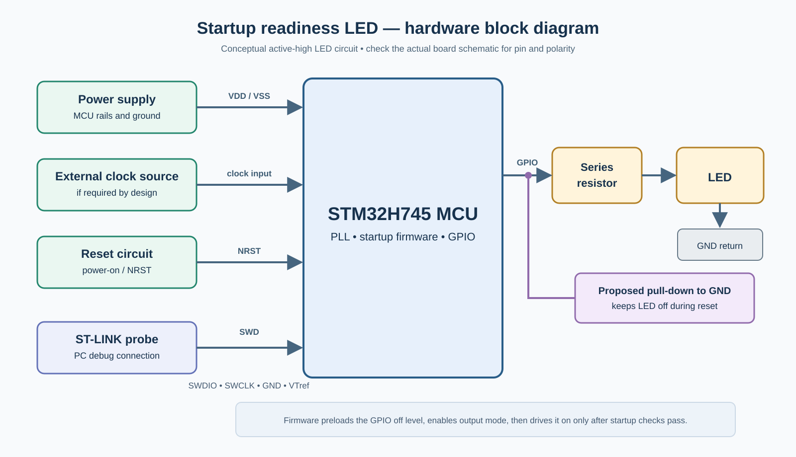

# Design Exercise 01 — Startup Readiness LED

**Status:** Guided design completed; implementation and exact board wiring remain open.  
**Curriculum:** Phase 0 tooling/debug path; Phase 1 Sections 1–2 hardware/CPU foundations, GPIO/MMIO/clock/reset concepts, and basic firmware structure.  
**Board:** STM32H745I-DISCO. The diagram below is a conceptual active-high implementation, not the verified Discovery-board LED circuit.

## 1. Design question and scope

Design firmware for a startup readiness LED. It turns on **only after all initialization required for the application succeeds**. It remains off on startup failure. Each reset begins a fresh readiness decision. The LED indicates startup readiness, **not continuous runtime health**.

This is an introductory hardware-and-firmware design. We have not specified exact board pins, electrical values, a timing budget, a watchdog policy, or a production recovery strategy.

## 2. Requirements, constraints, and assumptions

- A required clock configuration must succeed before normal application operation starts.
- Other required initialization steps must report success or a specific error. The actual application must provide the final list of steps.
- The readiness LED stays off during reset, before GPIO configuration, and on every initialization failure. Startup success is the only event that turns it on.
- A developer can attach ST-LINK over SWD to inspect a powered development board when debug access works.
- The diagram proposes an active-high LED with a suitable off-state bias. Actual LED polarity, MCU pin, reset behavior, and any existing pull resistor must be verified against the board schematic.
- For the clock-failure case discussed, firmware has reached a state where initialized RAM and debugger access are available. This does not generalize to every earlier failure.

## 3. Hardware blocks and connections

| Block / connection | Role |
|---|---|
| Power rails and ground → MCU | Allow MCU execution; exact supply implementation is board-specific. |
| External clock source → MCU, if used | Supplies the input for the required clock configuration; the PLL is inside the MCU. |
| Reset circuit → NRST | Restarts the readiness decision. |
| ST-LINK → MCU over SWD | Allows register/RAM inspection when the application is not running. |
| MCU GPIO → series resistor → LED → return | Drives the visible readiness signal and limits LED current. |
| Proposed GPIO off-state bias → ground | In the illustrated active-high example, holds the LED off while the MCU pin is not driving. |

Software cannot actively drive the GPIO while the MCU is held in reset. The circuit must provide the off state on its own. An actual board may use active-low wiring or another default-state arrangement; adjust the GPIO level and bias to its schematic.

## 4. Firmware blocks and execution sequence

**Responsibilities:** The startup coordinator makes the readiness decision. Initialization routines report success or error. The LED driver configures and drives GPIO; it does not decide whether the application is ready.

1. Reset begins a new startup attempt with readiness false and the LED off by hardware default.
2. Startup initializes the runtime and performs the required clock and application initialization in an order compatible with the board. Each required step reports its outcome.
3. When the LED GPIO port is usable, its driver prepares the **off** value in the output data register *before* enabling output mode. This avoids a brief on-level if the output latch held that value. The physical pin begins driving the off level once output mode is selected.
4. After **every** required step has succeeded, the coordinator turns the readiness LED on and starts normal application operation.
5. On a required-step failure, the coordinator records a specific error when possible and enters the chosen safe state without turning the readiness LED on.

The hardware default matters especially if clock setup fails before the LED GPIO can be configured.

## 5. Decisions, alternatives, and reasons

| Decision | Reason and tradeoff |
|---|---|
| Startup coordinator owns readiness; LED driver owns GPIO | Keeps application policy separate from register access. |
| Readiness requires all application-critical steps, not simply reaching `main()` | Avoids claiming that a board can run the application when its required clock or another dependency failed. The exact critical-step list remains application-specific. |
| Prepare the off output value before enabling GPIO output mode | Avoids a transient LED flash from an unwanted output latch value. The pin itself is not driven while still in input/analog mode. |
| Keep LED off after clock failure; do not run normal application | The application was defined as requiring that clock. A fallback clock is possible only as a separately specified and validated reduced-function mode. |
| For this development board, preserve a debuggable safe state rather than reset indefinitely | Gives developers a stable chance to inspect error state; a repeated reset can discard RAM evidence. A production board might need another recovery policy. |
| Use a RAM error code when RAM is available | Distinguishes `CLOCK_INIT_FAILED` from other initialization failures through SWD. RAM may be unavailable for an earlier failure and is normally lost on power loss or reset. |
| Keep the readiness LED off for *every* startup failure | Preserves an unambiguous user meaning. A separate optional diagnostic LED could show a general error; blinking needs a known working clock and cannot be promised at a one-second rate after the preferred clock fails. |

## 6. Failure behavior and diagnosis

If a required step fails, readiness stays false, normal application behavior does not start, and the board remains in a safe, inspectable state where feasible. The development-board failure path must avoid relying on a service—such as logging or the preferred clock—that may itself be unavailable.

An off LED means **not ready**, but alone cannot distinguish loss of power, early startup failure, clock failure, or application initialization failure. If RAM has been initialized, a debugger can read a startup error code. If the failure occurs before RAM or debug access is available, this diagnostic path may not work. An optional second LED is a separate design extension, not a prerequisite of the basic readiness indicator.

## 7. Validation

- Reset the board: verify the LED remains off through reset and early initialization, with no transient flash.
- Allow every required step to succeed: verify the LED turns on only after the final required success and application operation begins.
- Force a required clock failure: verify the LED stays off, normal application operation does not start, and the failure code can be inspected when RAM/debug access is available.
- Force another required initialization failure: verify a distinguishable error code and the same off/safe behavior.
- Compare the conceptual circuit with the actual board schematic before testing electrical polarity and default state on hardware.

## 8. Open questions and future extensions

- Verify the actual STM32H745I-DISCO LED circuit, GPIO pin, polarity, pull state, and reset defaults. The figure is not a literal board schematic.
- Specify the complete list and order of application-critical checks, plus what “safe state” disables for that application.
- Decide whether later runtime faults should extinguish the LED or use a different health indicator; this exercise only promises startup readiness.
- Revisit timeouts, retry policy, watchdog, logging persistence, power failure, and production recovery when those curriculum concepts are covered.

## Evidence from the guided discussion

The learner separated startup policy from LED hardware control, required the application clock before asserting readiness, selected a debuggable safe state over an endless reset loop for the development board, proposed independent error indication, and requested the hardware block view. The off-state GPIO latch and physical reset behavior were taught during the exercise. This is design practice, not evidence of independent end-to-end mastery or board implementation.
