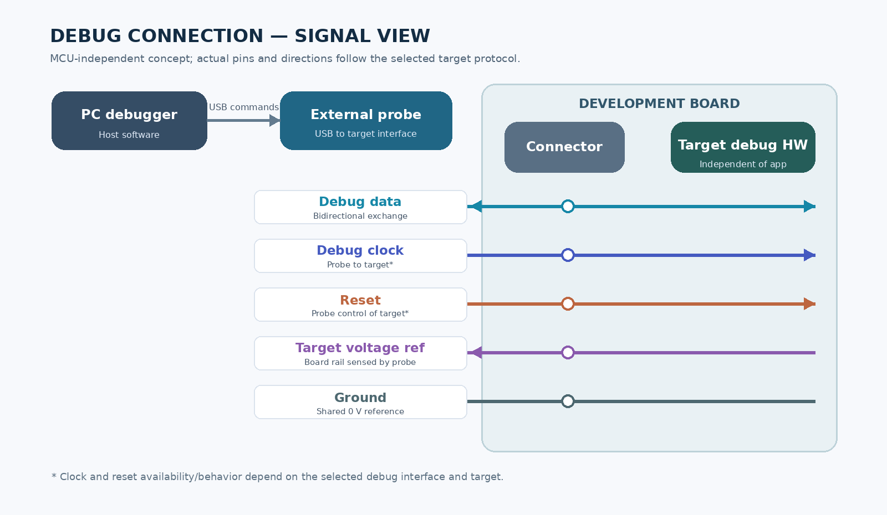

# Design Exercise 02 — Debug Access for a Development Board

**Status:** Guided conceptual design completed; target-specific implementation and hardware validation remain open.

**New concept:** Phase 0 — on-board versus external debug-probe placement.

**Scope:** MCU-independent design for one development board. Probe fleet sizing is a later scaling question.

## 1. Design question and scope

> A team is creating an embedded controller board for firmware development. Engineers need to program it and investigate failures, including cases where the application cannot start. Design how engineers will get debug access to the board. Keep the design independent of any particular MCU.

The design must work on a blank board and on a powered board whose application fails before normal startup. The target's hardware debug interface is assumed accessible. Physical damage, permanent debug lockout, and a board without working power are outside this exercise.

## 2. Requirements, constraints, and assumptions

### Functional requirements

- Program a blank board or replace faulty firmware; verify the stored image against the intended image.
- Read back firmware bytes and identify the installed build without relying on the application to run.
- Connect to a powered target after application failure, reset and regain control during an early failure, and halt, resume, and step at source or instruction level where supported.
- Read CPU registers; read and write accessible target memory; inspect a recoverable stack and fault context.
- Set breakpoints and watchpoints within the target's capabilities; view disassembly and use an ELF matching the installed firmware for reliable symbols and source mapping.

### Quality goals and design constraints

The discussion considered low added board cost and area, stable connection, reasonable flash-and-verify time, and transparent reporting of finite hardware breakpoint/watchpoint resources. Working targets proposed during clarification were **2 MiB programmed and verified within 60 seconds at p95** under normal bench conditions and **at least 99% of programming/debugging sessions without an unexpected debug-link disconnect**. Neither has been measured. The selected probe, target, image, cable, and bench setup determine whether these targets are achievable.

The later scenario of 20 boards and eight engineers was used to explore sharing economics. It does not change the one-board architecture question; the number of shared probes and any waiting-time target remain a separate scaling study.

## 3. High-level architecture and signals

**Path:** PC debugger/programming tool → USB → external probe → board connector → target debug hardware and controller. The external probe translates host requests into the target's supported debug interface. The board exposes that interface without depending on application firmware.

The diagram shows conceptual roles, not a universal pinout:

| Connection | Role |
|---|---|
| Debug data and clock | Carry the selected synchronous debug protocol; actual signal count, direction, and names depend on that protocol. |
| Reset control | Lets a compatible probe coordinate reset and early halt when faulty firmware interferes with normal attachment. The exact sequence is target-dependent. |
| Shared ground | Gives probe and target debug signals a common electrical reference and return path. |
| Target-voltage reference | Lets the probe sense the board's debug I/O voltage; it does not by itself mean the probe powers the board. |

The connector, cable, probe, and target must have compatible signal levels and pin assignments. A known-good cable and connection/read test help distinguish link problems from firmware problems.

## 4. Hardware/software partitioning and detailed behavior

| Part | Responsibility |
|---|---|
| PC tool and debugger | Select the image, issue programming/debug commands, read the ELF as data for symbols and source-to-address mapping, and verify target readback. The PC does not execute the target firmware. |
| External probe | Translate and carry host requests over the target debug connection, control supported reset/debug operations, and report target responses or failures. |
| Target debug/programming hardware | Provide access to execution control, registers, memory, and nonvolatile programming through the supported target mechanism, independent of the application. |
| Application image | Include a readable build ID at an agreed nonvolatile location. It need not run to expose that ID through debug readback. |

### Programming and identification

The PC programs a blank or faulty target through the probe, performing any required erase as part of the operation. It reads back the programmed ranges and compares them with the intended image. The learner proposed a full-image hash comparison alongside the build ID; a byte-for-byte comparison is another direct verification option. A stored build ID alone does not prove that the entire image was programmed.

The binary and ELF are generated from the same build. The build ID appears in an ELF loadable region that is also included at a documented location in the programmed image. The debugger reads the board's ID through the probe and compares it with the matching ELF before trusting source-level addresses. Build date/time may help humans but is not a unique identity by itself.

### Debug commands

The PC debugger maps a source line in the matching ELF to a target address. The probe conveys a breakpoint request, and the target reports whether it was installed. The UI must not show a requested breakpoint or watchpoint as active if the target rejected it because hardware resources are exhausted.

Hardware breakpoints need not modify code, which matters for code in flash. A software breakpoint normally patches an instruction and cannot be assumed safe at an arbitrary flash address. A conditional watchpoint can show only interesting values, but a condition checked on the host may still cause many hidden halt/evaluate/resume cycles and perturb timing. Target-side condition filtering, where available, is an implementation-dependent improvement rather than a universal promise.

## 5. Decision, failure behavior, and tradeoffs

**Decision:** use an external probe and a documented board-side debug connector. An on-board probe would make each board self-contained and remove the external probe-to-board cable, but adds circuitry, board area, integration effort, and recurring cost. The external choice supports reuse and lowers per-board hardware, with cable/connector compatibility and connection reliability to manage. The earlier illustrative $200 estimate for 20 on-board probes was an exercise assumption, not a bill of materials.

For an early startup failure, first try to halt and inspect the still-reachable target **before resetting**, preserving volatile evidence where possible. Read the PC, registers, accessible memory, and fault context. If normal attachment is impossible because the application fails too quickly, use the target-supported connect-under-reset or halt-on-reset mechanism: establish control around reset, release reset in the required sequence, and halt at the earliest supported point. Then step or place breakpoints to reproduce and locate the fault. Holding reset for the whole flash operation is not a general rule.

Reset returns execution toward startup but can destroy prior RAM state; it does not reveal the earlier fault location by itself. If a session appears disconnected, check board power and voltage reference, cable and connector, then attempt a debug read of a target identifier or register. Plausible voltages alone do not establish that the data path works.

## 6. Validation and lifecycle

1. **Blank board:** connect, identify the target, program an image without existing application code, read back and verify it, then run or debug it.
2. **Early-failure image:** deliberately fail before normal startup. Show that the probe can connect, reset/halt early, read registers and memory, inspect the installed build ID, step or set a hardware breakpoint, and replace the image with a verified working build.
3. **Matching symbols:** verify that board and ELF build IDs agree. Show a clear warning or refusal of trusted source mapping when they differ.
4. **Connection:** exercise repeated connect, reset, debug read, program, and verification operations across representative boards, probes, cables, and hosts. Distinguish an application crash from a lost debug link by checking whether a target debug read still succeeds.
5. **Programming time:** measure from the user's flash command until successful readback verification of a 2 MiB image. The learner proposed about 1,000 repetitions spread across several setups for an empirical p95; report failures separately. This is a proposed validation plan, not a measured result.

Keep the connector pinout, voltage range, approved cable/probe pairing, build-ID location, and recovery procedure documented for engineers. Revisit link reliability and shared-probe availability with actual usage measurements if the design is deployed across many boards.

## Decision recap and open questions

The external probe, board connector, shared electrical references, and target hardware debug path make programming and investigation independent of a running application. The host uses readback and a matching ELF to verify and interpret the target state. Exact protocol, connector, probe model, flash mechanism, reset/halt behavior, and hardware resource counts must be selected and validated for a real target; none is prescribed by this MCU-independent design.

## Evidence from the guided discussion

The learner drew the PC → external probe → board architecture and chose probe reuse after comparing per-board cost, PCB effort, cable reliability, and access demand. He identified debug data, clock, and reset; reasoned through shared GND and target voltage reference; proposed readback verification, build ID/date metadata, and a read-back-image hash; explained ELF-to-target address mapping and hardware breakpoint limits; and proposed multi-setup flash-time measurement. The mentor supplied or sharpened connect-under-reset nuances, software-breakpoint and watchpoint limitations, and the distinction between link voltage checks and a successful debug read. This remains guided conceptual design evidence, not hardware implementation or independent mastery.
