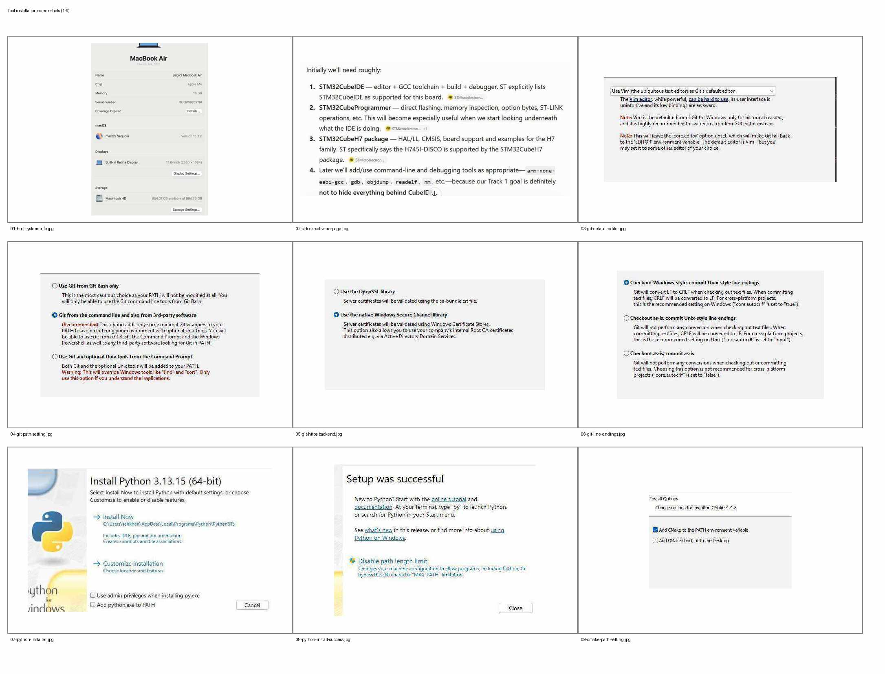
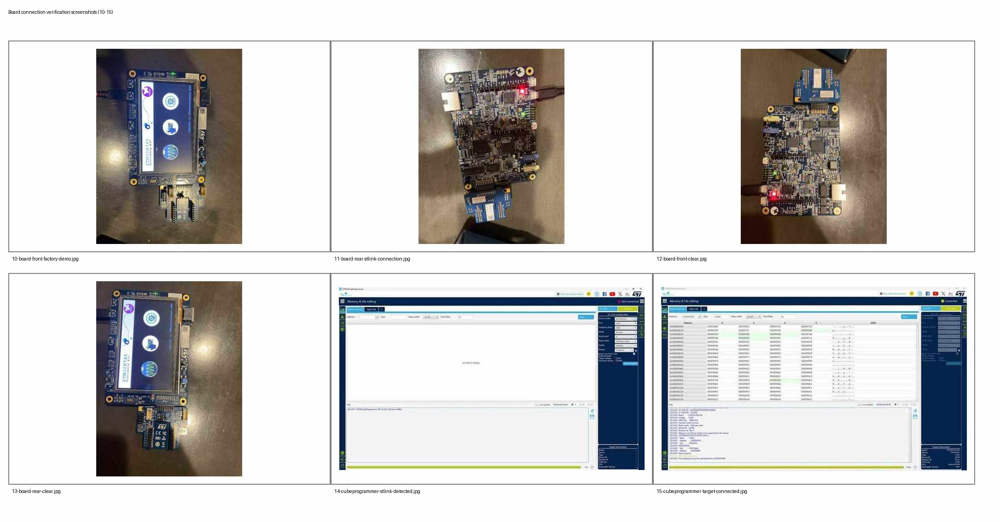

# Track 1 — Tools Installation and STM32H745I-DISCO Connection Verification

**Host OS:** Windows  
**Target board:** STM32H745I-DISCO / STM32H745I-DK  
**Scope:** Development-tool installation and initial board connectivity verification only. This document intentionally does **not** begin Phase 0 or any Track 1 board-learning exercises.

## 1. Purpose

This setup establishes a known-good Windows development environment for Track 1 and verifies the complete host-to-target debug path:

```text
Windows PC
    |
    | USB
    v
On-board STLINK-V3E
    |
    | SWD
    v
STM32H745
    +-- Cortex-M7
    +-- Cortex-M4
    +-- Flash / SRAM
```

The factory demonstration firmware was left intact during verification.

## 2. Installed software

| Tool | Purpose | Verification |
|---|---|---|
| STM32CubeIDE | STM32 IDE, compiler integration, build and debugging | Installed |
| STM32CubeProgrammer | Flashing, target memory inspection, option bytes and ST-LINK access | Installed and target connection verified |
| STM32CubeH7 | HAL/LL, CMSIS, board support and examples for STM32H7 | Installed |
| GNU Tools for STM32 | ARM cross compiler, debugger and binary-analysis utilities | Verified from PowerShell |
| Git for Windows | Source control | Verified |
| Python 3 | Scripting/tool automation | Verified |
| CMake | Build-system generation | Verified |
| Ninja | Build executor | Verified |

## 3. GNU ARM toolchain

STM32CubeIDE already contained the GNU ARM toolchain at:

```text
C:\ST\STM32CubeIDE_2.2.0\STM32CubeIDE\plugins\
com.st.stm32cube.ide.mcu.externaltools.gnu-tools-for-stm32.14.3.rel1.win32_1.0.100.202602081740\
tools\bin
```

The toolchain itself was present; the initial problem was that its `bin` directory was not in the Windows user `PATH`.

After adding it to `PATH` and opening a fresh PowerShell session, the following commands worked:

```powershell
arm-none-eabi-gcc --version
arm-none-eabi-gdb --version
arm-none-eabi-objdump --version
arm-none-eabi-readelf --version
arm-none-eabi-nm --version
```

Observed versions included:

```text
arm-none-eabi-gcc  14.3.1
GNU gdb            15.2.90
GNU binutils       2.44.0
```

## 4. Git for Windows

Git was installed with these choices:

- Default editor: Visual Studio Code.
- PATH option: **Git from the command line and also from 3rd-party software**.
- HTTPS backend: **native Windows Secure Channel library**.
- Line endings: **Checkout Windows-style, commit Unix-style line endings**.

Verification:

```powershell
git --version
```

Observed:

```text
git version 2.55.0.windows.5
```

## 5. Python

Python 3.13.15 (64-bit) was installed using the official Windows installer.

During installation:

- **Add python.exe to PATH** was enabled.
- Per-user installation was used.
- **Disable path length limit** was selected after installation.

Verification:

```powershell
python --version
py --version
pip --version
```

All three commands succeeded.

## 6. CMake

CMake 4.4.3 was installed with:

- **Add CMake to the PATH environment variable** enabled.
- Desktop shortcut not required.

Verification:

```powershell
cmake --version
```

The command succeeded from a fresh PowerShell session.

## 7. Ninja

Ninja was extracted as a standalone executable and placed in:

```text
C:\Tools\Ninja\ninja.exe
```

`C:\Tools\Ninja` was added to the Windows user `PATH`.

Verification:

```powershell
ninja --version
```

The command succeeded from a fresh PowerShell session.

## 8. Tool-installation screenshots

The following contact sheet contains **all tool-installation screenshots shared during this setup chat**, including the host reference, ST tools/software page, Git installer choices, Python installer/success screens, and CMake PATH selection.



Captured checkpoints:

1. Host machine reference.
2. ST tools/software page.
3. Git default-editor selection.
4. Git PATH selection.
5. Git HTTPS/SChannel selection.
6. Git line-ending selection.
7. Python installer and PATH option.
8. Python successful-install screen and path-length option.
9. CMake PATH option.

## 9. Final host-tool status

```text
STM32CubeIDE             PASS
STM32CubeProgrammer      PASS
STM32CubeH7              PASS

ARM GNU Toolchain
  arm-none-eabi-gcc      PASS
  arm-none-eabi-gdb      PASS
  arm-none-eabi-objdump  PASS
  arm-none-eabi-readelf  PASS
  arm-none-eabi-nm       PASS

Git                      PASS
Python                   PASS
CMake                    PASS
Ninja                    PASS
```

No additional tools are required before beginning the planned Track 1 board work. Additional tools should be introduced only when a curriculum topic requires them.

## 10. STM32H745I-DISCO physical connection

The STM32H745I-DISCO was connected to the Windows PC through the board connector marked **STLK**.

Physical observations:

- Board powered successfully.
- Status LEDs illuminated.
- Factory STM32H745 Discovery Kit demonstration ran successfully on the LCD.
- The factory firmware was **not erased or overwritten**.

This established a known-good board before debugger verification.

## 11. STM32CubeProgrammer — ST-LINK detection

With the board connected through the STLK USB connector, STM32CubeProgrammer detected the on-board ST-LINK.

Before connecting to the target, the observed configuration included:

```text
Interface:       ST-LINK
Port:            SWD
Frequency:       8000 kHz
Mode:            Normal
Access port:     0
Reset mode:      Software reset
Speed:           Reliable
Target voltage:  ~3.26 V
ST-LINK FW:      V3J3M2
```

The presence of the ST-LINK serial number and target voltage confirmed that the PC could see the debugger and that the target side was powered.

## 12. STM32 target connection verification

Selecting **Connect** in STM32CubeProgrammer succeeded.

Observed target information:

```text
Connection:      Connected
Board:           STM32H745I-DK
Device:          STM32H7xx
Device ID:       0x450
Revision ID:     Rev V
NVM size:        2 MB
CPU:             Cortex-M7/M4
Bootloader:      0x91
Target voltage:  3.26 V
```

CubeProgrammer also successfully read target memory starting at:

```text
0x08000000
```

The log reported a successful 1024-byte read. This verifies the complete path:

```text
Windows
  -> USB
  -> STLINK-V3E
  -> SWD
  -> STM32H745
  -> target memory access
```

## 13. Board-connection verification screenshots

The following contact sheet contains **all board photos and CubeProgrammer screenshots shared during this setup chat**.



Captured checkpoints:

10. STM32H745I-DISCO powered with factory demo running.
11. Rear-board view showing the STLK USB connection and active LEDs.
12. Clear front-board view.
13. Clear rear-board view.
14. STM32CubeProgrammer with ST-LINK detected before target connection.
15. STM32CubeProgrammer after successful SWD connection and target-memory read.

## 14. Verification result

**Tools installation: COMPLETE**

**Initial board connection verification: COMPLETE**

Confirmed:

- Windows development environment is ready.
- ARM GNU command-line tools are globally accessible.
- Git, Python, CMake and Ninja are operational.
- STM32H745I-DISCO powers and runs known-good factory firmware.
- Windows detects the on-board STLINK-V3E.
- STM32CubeProgrammer communicates with the target over SWD.
- STM32CubeProgrammer identifies the STM32H745I-DK correctly.
- Target Flash can be read non-destructively.
- Factory firmware remains intact.

---

This document records environment preparation only. Actual Phase 0 / board-learning work belongs in the Track 1 learning flow.
